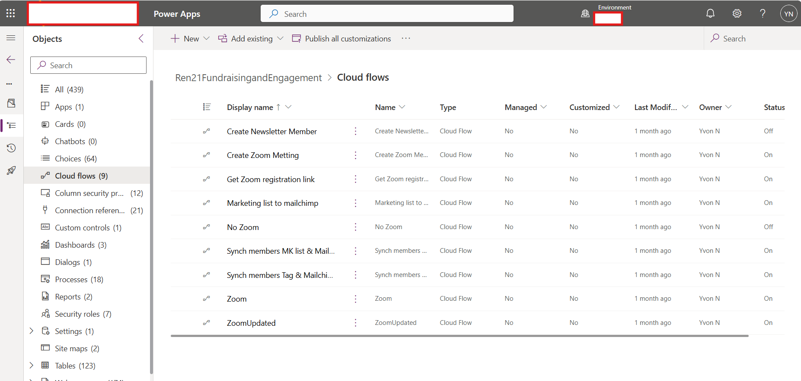
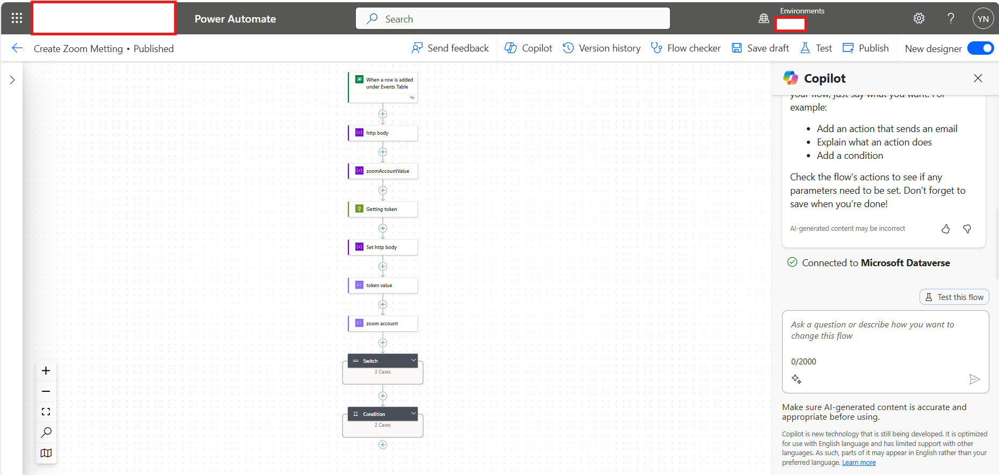
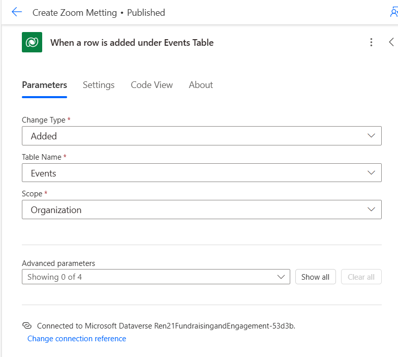

# Automations

As part of automations, Power automate flows and plug-ins have been built.

## Power automate flows

 

1. Create Zoom Meeting
This flow help users to create a Zoom meeting directly from dynamics 365

### Global flow
 

### Detailed flow
 
```
{
  "type": "InitializeVariable",
  "inputs": {
    "variables": [
      {
        "name": "http body",
        "type": "object"
      }
    ]
  },
  "runAfter": {},
  "metadata": {
    "operationMetadataId": "0d45e7f9-10f1-436b-9080-129d0fab2c47"
  }
}
```
3. 
4. 
## C# Plug-Ins
