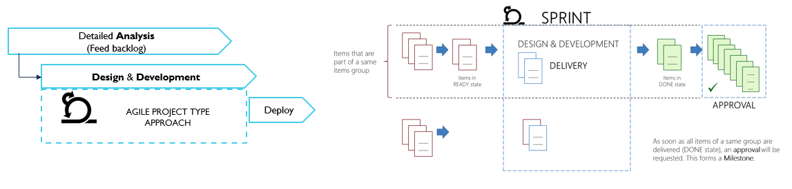
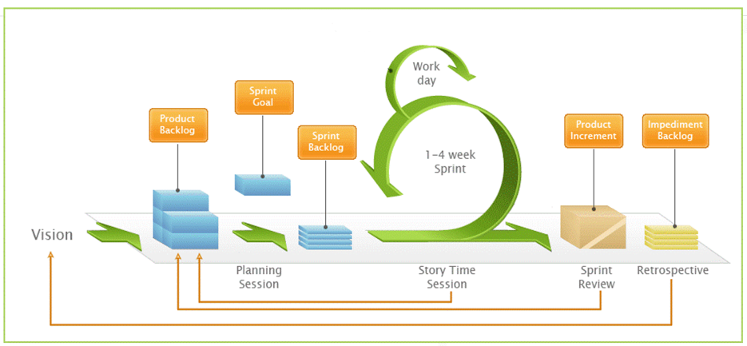
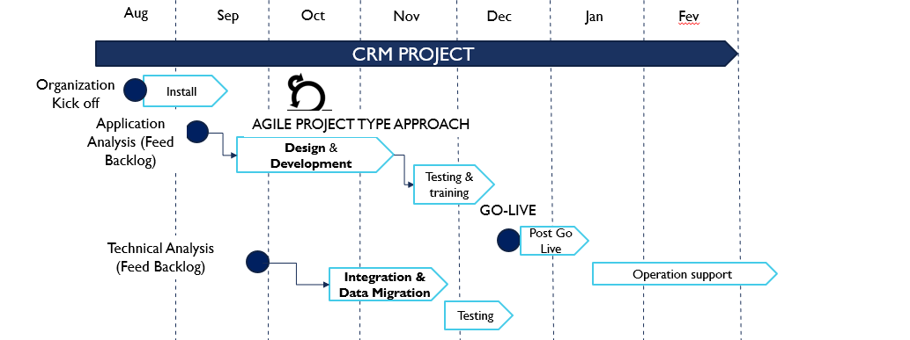
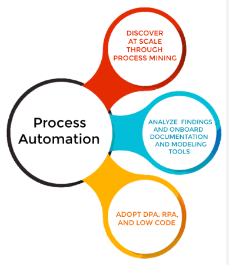
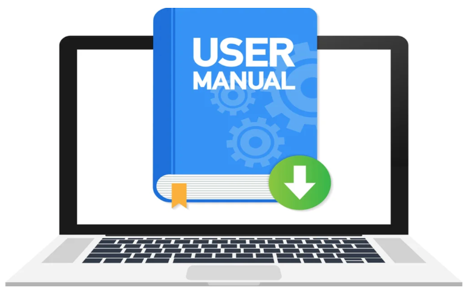

# Dynamics 365 CRM for NGO
This is the Repository where all documentation for project implementation of Dynamics 365 for an NGO based in Paris (France) is stored.
To keep confidentiality closes, the NGO will be called Alpha.

## Context
- Alpha is a Non Profit Organizations with main activities such as :
- Network: Community Platform for Stakeholder acting in Sustainable Energy
- Events – Online and Offline (Debates, RENdez-vous online debates, and Conferences)
- Marketing Campaign 
- Yearly reports through research and surveys on the status of Renewables’ development
- Fundraising

Alpha uses a basic version of Insightly which was deployed in 2013 with a single user account. Insightly basic version is lacking in its functionality in Contact Management, Activity and Event management, Marketing and Campaign Management, Metric and Reporting causing a desinterest from Alpha to use Insightly. Insightly is used as an address book where team members are doing data entry, data tagging, export the reports requested by management. The lack of understanding what a CRM is for and thorough training on how to use the platform properly is causing poor data entry quality. As result, very few staff members spend time now in Insightly, some never use or open it.

## Description of the target mission

- [x] Target the entities to configure (Lead, Contact, Account, Opportunity, Gift, Task, Campaign, Event, Email, PhoneCall) and the settings to achieve (volume & complexity)
- [x] Identify the business processes to be configured (Constituent management, Fundraising & Engagement, Marketing and Events Management)
- [x] Identify the steps of each process, including the prerequisites to be validated to move to the next step in the CRM.
- [x] Identify related cross-functional needs if applicable: mail synchronization, MailChimp, Zoom synchronization, alert settings.
- [x] Identify the KPIs and dashboards required to the operational management of activities on the one hand and reporting (for decision-makers).

## Project Team
|Alpha NGO| CRM Assets Consulting|
| --------| ---------------------|
|Alpha Team Members| CRM AssetsTeam Members|
| |
|Assistant Project Manager : Ayu |Business Analyst: Yvon|
|IT / Processes/Product Owner: Thomas|Technical Analyst: Valentin|
|Community Engagement & Partnership: Vijay| Architect & PM: Fabrice|
|Digital Media: Kelly / Sandra | Integration Developer: Yvon|
|Strategic Communication: Yasmine|Extra resources from the CRM Assets staff if needed|
|Knowledge & Data : Nathalie||
|Fundraising & Institutional : Sophia||
|Administrative & Office Manager: Stephane||
|Membership & Institutional Parnership: Laure||

## Methodology & Organization

 

*The solution will be delivered in Agile Mode*

1. Analysts (Functional and Technical) will create the product backlog items based on the pre-study conclusions
2. Delivery teams will take in charge the items across sprints (from READY to DONE)
3. Items will be grouped by topics. When a topic is full done, we would not come back on it (except via a new official demand)
Note: Items will be managed using Azure DevOps (CRM Assets Tool)

## Agile methodology and sprint role

 

*Sprint Cycle Manager (“Scrum Master”) – CRM Assets Resource*
- Coordinates resources during the sprint
- Ensures the methodology respect
- Lead the meetings

*Business Analyst – CRM Assets Resource*
- Animates analysis workshops and build backlog according to the product owner requests
- Is key reference for the project team

*Product Owner – Alpha Resource*
- Makes the link between the project team and the business line
- Provide all required elements that must be collected near the business line
- Validates the deliveries (testing sessions results review & approval)

*Project Team Members – CRM Assets Resources*
- Delivers the backlog items
- Package the solution and deploy it in the environments

## Defintion of ready and definition of done

A task is considered as READY state when the following conditions are met: 
- Detailed analysis is done and documented
- The analysis has been reviewed and approved by the Product Owner
- All required information, document or support from the business have been received and reviewed by the Business Analyst
- When a task is READY, it can go into a Sprint backlog

A task is considered as DONE state when the following conditions are met: 
- Item is delivered/developed 
- Item is deployed in Test environment and ready to be deployed
- When a task is DONE, it can go out of the sprint.

Note: Acceptance testing as well as deployment tasks will be considered as Sprint tasks as well

## Team organization and meetings

1. A SteerCo will be scheduled 
- At the beginning of the project 
- A backlog refinement at the beginning of a sprint cycle
- A sprint review at the end of a sprint cycle 

2. 2-weekly meetings will receive the participation of all involved actors of the running Sprint (+/- 15mn )

3. Analysis meeting, for application or technical analysis

## Project task and project review

| Main tasks | Date | Resp | Paticipants | Status |
| ---------- | ---- |------|-------------|--------|
|Purchase the Sales Licenses with the NGO Discounts|09/09/2022|Thomas||TO DO|
|Functional Workshop - Constituant / Contacts|09/09/2022|Yvon/Fabrice|Vijay/Alain/Thomas|TO DO|
|Functional Workshop - Fundraising|09/09/2022|Yvon/Fabrice|Shiaya/Thomas|TO DO|
|Functional Workshop - Knowledge (Report production)|09/09/2022|Yvon/Fabrice|Nathalie/Ahmed/David|TO DO|
|Functional Workshop - Campaign/Events/Target List/Activities/Surveys|09/09/2022|Yvon/Fabrice|Ahmed/David|TO DO|
|Functional Workshop - Security Model (roles, teams, bu)|09/09/2022|Yvon/Fabrice|Ahmed/David|TO DO|
|Functional Workshop - Data Migration (data mapping)|09/09/2022|Yvon/Fabrice|Ahmed/David|TO DO|
|Technical Workshop Integration|20/09/2022|Yvon/Fabrice|Jeff/Shian|TO DO|
|Create Dynamics 365 Environments (DEV, UAT)|21/09/2022||TO DO|
|Adapt security model (bu/roles) & Add users|22/09/2022|Yvon/Valentin||TO DO|
|Adapt default entities and Create custom ones|23/09/2022|Yvon/Valentin||TO DO|
|Data Migration Dev (Organizations, Contacts, roles etc…)|23/09/2022|Yvon|Vijah/Jeff/David|TO DO|
|Dev. Of Integration Packages (Mailchimp, Zoom, etc…)|23/09/2022|Yvon||TO DO|
|UAT Environment preparation ( application / setup /data)|24/10/2022|Yvon/Fabrice||TO DO|
|Backlog Document ( functional - entities / security roles)|25/10/2022|Valentin||TO DO|
|Backlog Document ( data migration / integration)|28/10/2022|Yvon||TO DO|
|UAT Document test Scenarios - functional aspects|02/11/2022|Yvon/Valentin||TO DO|
|Accompany Test session|09/09/2022|Yvon/Valentin||TO DO|
|UAT corrections / Retests|22/11/2022|Yvon/Valentin||TO DO|
|Deployment Plan to Prod|25/11/2022|Yvon/Fabrice|Vijay/Ted/David|TO DO|
|Prepare End User training|09/09/2022|Yvon||TO DO|
|Execute Key User training|05/12/2022|Yvon|TO DO|TO DO|
|GO LIVE|15/12/2022|Yvon/Fabrice/Valentin|Keys users|TO DO|
|Post Go Live Support|15/12 =>06/01/2023|Yvon/Valentin||TO DO|

## Deliverables

Dynamics 365 Sales Application on 3 environments (DEV, UAT and PROD)

- Sales App, Marketing App, Fundraising & Engagement App, Custom Entities & Business Processes
- Entity Diagram updated 
- BPMN updated 
- Functional / Technical descriptions of the developments 
- Functional / Technical descriptions of the integrations 
- Training Manual: Basic & Advanced
- Import templates for data Migration

## Timeframe

 

# Application LifeCycle Management (ALM)
*Click on the icon to see the ALM*

# Power automate flows
*Click on the icon to see automations*

# C Sharp plug-ins
*Click on the icon to see automations*

# Data migration Console App
*Click on the icon to see automations*

# Python codes
*Click on the icon to see automations*

# User guides
*Click on the icon to see fonctional and technical documents*

