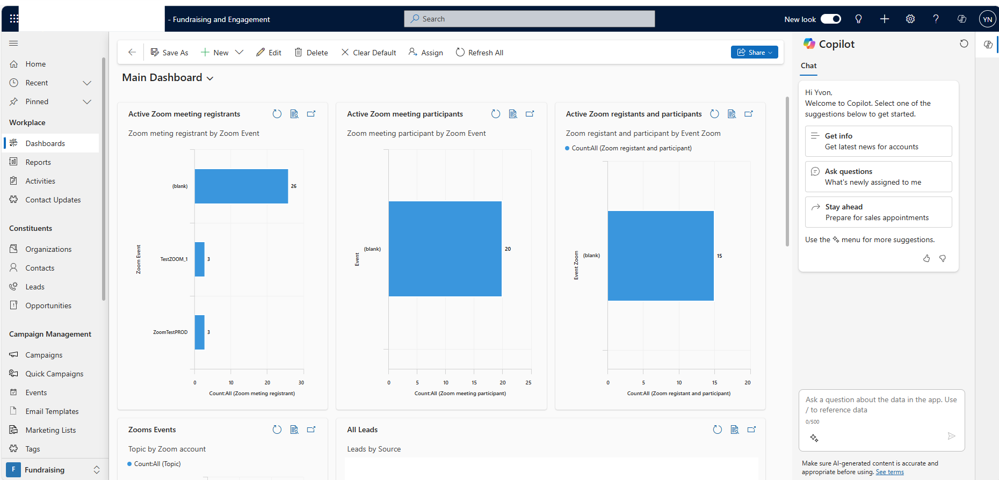

# User guides

## Functional user guide

### Workplace 

#### Dashboard

##### Role of a dashboard
Dashboards in Dynamics 365 Sales provide an overview of actionable business data that's viewable across the organization. Use dashboards to see important data at a glance. 
Any user can build his own dashboard and share it to other users to give them access to it. 

##### Dashboard overview
 

## Technical user guide
