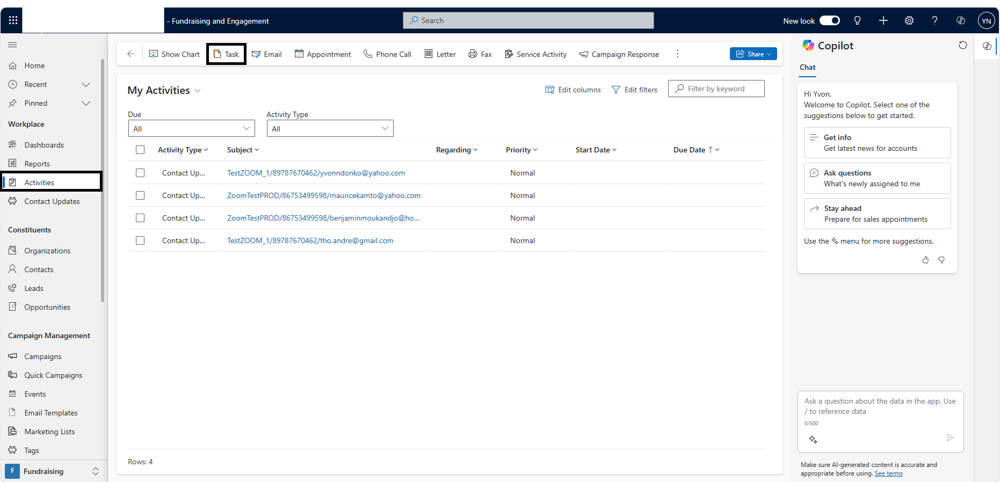
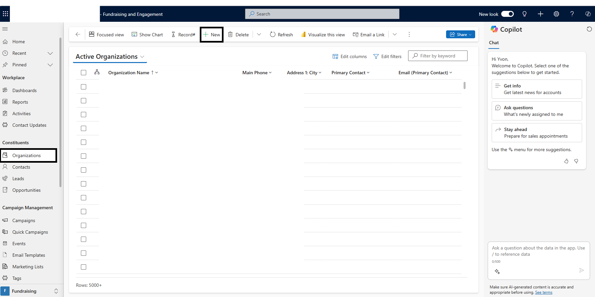

# User guides

## Functional user guide

### Workplace 

#### Dashboard

##### Role of a dashboard
Dashboards in Dynamics 365 Sales provide an overview of actionable business data that's viewable across the organization. Use dashboards to see important data at a glance. 
Any user can build his own dashboard and share it to other users to give them access to it. 

##### Dashboard overview
 

#### Activities

##### What is an activity?
In Dynamics 365 Sales, you use activities to plan, track, and organize all your customer communications.  
For instance, after creating a Campaign, the marketing manager can define planning activities required to lunch the campaign like determining the budget of the campaign, buy all accessories regarding the Campaign, and so on. 

###### Create a new activity
Let us create a Task activity type (you can create any other type as well, like Email, Appointment, Phone call …). 
 

### Constituents 

#### Create a new Organization
 

#### Create a new Contact

## Technical user guide
